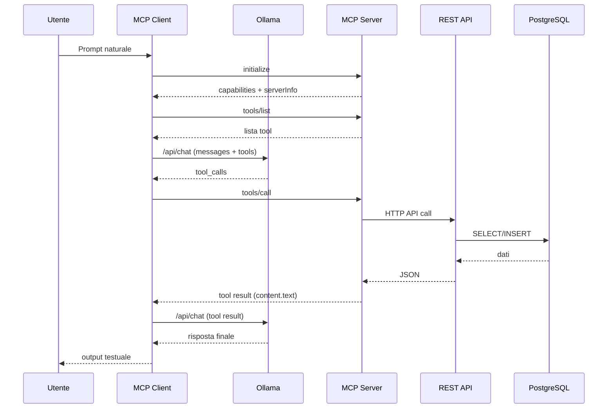

# Mock REST API + MCP Server/Client + Ollama (Guida Didattica)

Questa repository mostra una pipeline completa in cui un LLM (via Ollama) puo parlare con una REST API usando MCP.

Obiettivo pratico:

- avere una REST API mock con dati reali su PostgreSQL;
- esporre le operazioni API come tool MCP;
- usare un MCP client che passa i tool a Ollama e lascia al modello decidere quando chiamarli.

In questo modo il modello non inventa i dati: li legge/scrive realmente sul DB tramite tool.

## 1) Architettura generale

Componenti:

- `REST API` (`FastAPI`): espone endpoint HTTP (`/customers`, `/orders`) e usa PostgreSQL.
- `PostgreSQL`: persistenza reale dei dati.
- `MCP Server` (stdio + JSON-RPC): traduce chiamate tool MCP in chiamate HTTP alla REST API.
- `MCP Client`: orchestration layer tra Ollama e MCP Server.
- `Ollama`: LLM che riceve lista tool e decide quando invocarli.

Flusso ad alto livello:

1. L'utente scrive un prompt al MCP client.
2. Il client inizializza sessione MCP col server (stdio).
3. Il client prende i tool disponibili (`tools/list`).
4. Il client invia prompt + schema tool a Ollama (`/api/chat`).
5. Ollama puo rispondere con `tool_calls`.
6. Il client esegue ogni tool chiamando MCP (`tools/call`).
7. Il MCP server chiama la REST API.
8. La REST API legge/scrive su PostgreSQL.
9. Il risultato torna indietro fino a Ollama, che produce la risposta finale in linguaggio naturale.

## 2) Struttura progetto

```text
.
├── app/
│   ├── config.py
│   ├── database.py
│   ├── db_bootstrap.py
│   ├── main.py
│   └── schemas.py
├── mcp_server/
│   └── server.py
├── mcp_client/
│   └── client.py
├── run_api.py
├── requirements.txt
├── .env.example
└── README.md
```

## 3) Prerequisiti

- Python 3.9+
- PostgreSQL in Docker (gia disponibile nel tuo setup)
  - host: `localhost`
  - port: `5432`
  - user: `postgres`
  - password: `postgres`
- pgAdmin opzionale: `http://localhost:5050`
- Ollama in esecuzione su: `http://127.0.0.1:11434`

## 4) Configurazione

Copia file env:

```bash
cp .env.example .env
```

Valori principali:

- `POSTGRES_HOST=127.0.0.1`
- `POSTGRES_PORT=5432`
- `POSTGRES_USER=postgres`
- `POSTGRES_PASSWORD=postgres`
- `POSTGRES_DB=misc_svc`
- `API_BASE_URL=http://127.0.0.1:8000`
- `OLLAMA_URL=http://127.0.0.1:11434`
- `OLLAMA_MODEL=gpt-oss:120b-cloud`
- `MCP_SERVER_COMMAND=.venv/bin/python`
- `MCP_SERVER_ARGS=-m mcp_server.server`

Nota importante:

- Il client avvia il server MCP come processo figlio via stdio.
- `MCP_SERVER_COMMAND` deve puntare a un python valido nell'ambiente corrente.

## 5) Setup rapido

```bash
cd /Users/antoniolatela/Documents/mcp_trial
python3 -m venv .venv
source .venv/bin/activate
pip install -r requirements.txt
cp .env.example .env
```

## 6) Bootstrap database (crea DB/tabelle/seed)

Comando:

```bash
source .venv/bin/activate
python -m app.db_bootstrap
```

Cosa fa `app/db_bootstrap.py`:

1. si connette al DB admin (`postgres`);
2. verifica se esiste `misc_svc`;
3. se manca, lo crea;
4. si connette a `misc_svc`;
5. crea tabelle:
   - `customers(id, name, email, created_at)`
   - `orders(id, customer_id, item, amount, status, created_at)`
6. inserisce seed idempotente:
   - 2 clienti iniziali
   - 2 ordini iniziali

Idempotenza:

- puoi rilanciare il bootstrap senza duplicare i record seed principali.

## 7) Avvio servizi

### 7.1 Avvia REST API

```bash
source .venv/bin/activate
python -m uvicorn app.main:app --host 0.0.0.0 --port 8000 --reload
```

Endpoint utili:

- `GET /health`
- `GET /customers`
- `POST /customers`
- `GET /orders`
- `POST /orders`

Swagger:

- `http://127.0.0.1:8000/docs`

### 7.2 Avvia MCP server (opzionale manuale)

Il client lo avvia automaticamente. Se vuoi provarlo separatamente:

```bash
source .venv/bin/activate
python -m mcp_server.server
```

### 7.3 Avvia MCP client con Ollama

Una richiesta singola:

```bash
source .venv/bin/activate
python -m mcp_client.client "Mostrami clienti e ordini"
```

Modalita interattiva:

```bash
source .venv/bin/activate
python -m mcp_client.client
```

## 8) Come funziona il colloquio MCP client-server-API (dettaglio)

Diagramma sequenziale:



### Passo A: inizializzazione MCP

`mcp_client/client.py` apre un processo figlio:

- comando: `.venv/bin/python -m mcp_server.server`
- transport: stdio
- protocollo: JSON-RPC con frame `Content-Length`.

Il client invia:

- metodo: `initialize`
- versione protocollo: `2024-11-05`

Il server risponde con:

- `capabilities.tools`
- `serverInfo`.

### Passo B: discovery dei tool

Il client chiama `tools/list`.

Il server restituisce i tool con schema JSON:

- `health_check`
- `list_customers`
- `create_customer`
- `list_orders`
- `create_order`

### Passo C: tool schema -> Ollama

Il client converte i tool MCP in formato function-calling atteso da Ollama e invia:

- `messages` (system + user)
- `tools` (funzioni disponibili)
- endpoint: `POST /api/chat`

### Passo D: decisione LLM

Ollama puo rispondere con:

- testo finale diretto, oppure
- `tool_calls` da eseguire.

### Passo E: esecuzione tool

Per ogni tool call:

1. il client chiama MCP `tools/call`;
2. il server individua l'handler del tool;
3. l'handler fa una chiamata HTTP alla REST API (`httpx`);
4. la REST API opera su PostgreSQL;
5. il risultato torna al client come `content[type=text]`.

### Passo F: risposta finale

Il client aggiunge il risultato tool ai `messages` con ruolo `tool` e richiama Ollama.

- Se ci sono altri tool_calls, il ciclo continua.
- Se non ci sono tool_calls, il testo assistant viene stampato come output finale.

### Esempio reale di messaggi (semplificato)

`initialize` (client -> server):

```json
{
  "jsonrpc": "2.0",
  "id": 1,
  "method": "initialize",
  "params": {
    "protocolVersion": "2024-11-05",
    "capabilities": {},
    "clientInfo": {"name": "ollama-mcp-client", "version": "1.0.0"}
  }
}
```

`tools/list` response (server -> client, estratto):

```json
{
  "jsonrpc": "2.0",
  "id": 2,
  "result": {
    "tools": [
      {"name": "list_customers", "inputSchema": {"type": "object", "properties": {}}},
      {"name": "create_order", "inputSchema": {"type": "object", "properties": {"customer_id": {"type": "integer"}}}}
    ]
  }
}
```

Chiamata a Ollama con tool disponibili (client -> `POST /api/chat`):

```json
{
  "model": "gpt-oss:120b-cloud",
  "messages": [
    {"role": "system", "content": "Sei un assistente..."},
    {"role": "user", "content": "Mostrami i clienti"}
  ],
  "tools": [
    {
      "type": "function",
      "function": {
        "name": "list_customers",
        "parameters": {"type": "object", "properties": {}}
      }
    }
  ],
  "stream": false
}
```

Risposta con `tool_calls` (Ollama -> client, estratto):

```json
{
  "message": {
    "role": "assistant",
    "content": "",
    "tool_calls": [
      {"id": "call_1", "function": {"name": "list_customers", "arguments": {}}}
    ]
  }
}
```

`tools/call` (client -> server):

```json
{
  "jsonrpc": "2.0",
  "id": 3,
  "method": "tools/call",
  "params": {"name": "list_customers", "arguments": {}}
}
```

`tools/call` response (server -> client, estratto):

```json
{
  "jsonrpc": "2.0",
  "id": 3,
  "result": {
    "content": [
      {
        "type": "text",
        "text": "{\"ok\": true, \"status_code\": 200, \"data\": [...]}"
      }
    ]
  }
}
```

## 9) Approfondimento codice file-per-file

### `app/config.py`

Responsabilita:

- caricare `.env`;
- centralizzare configurazioni DB/API in dataclass `Settings`.

Punti chiave:

- fallback robusti per sviluppo locale;
- un solo punto di verita per host/porte/credenziali.

### `app/database.py`

Responsabilita:

- creare connessione PostgreSQL applicativa verso `POSTGRES_DB`.

Scelte:

- `row_factory=dict_row` per ottenere record come dizionari.

### `app/db_bootstrap.py`

Responsabilita:

- provisioning DB e schema iniziale.

Funzioni chiave:

- `_admin_conn()`: connessione al DB amministrativo (`postgres`);
- `_app_conn()`: connessione al DB applicativo (`misc_svc`);
- `create_database_if_missing()`: crea DB se non esiste;
- `create_tables_and_seed()`: crea tabelle + seed;
- `bootstrap_database()`: orchestration finale.

Dettagli importanti:

- creazione DB con identificatore SQL sicuro (`Identifier`);
- vincoli DB: `UNIQUE(email)`, FK su `orders.customer_id`, check su `amount >= 0`.

### `app/schemas.py`

Responsabilita:

- validazione payload request/response via Pydantic.

Esempi:

- `CustomerCreate(name, email)`
- `OrderCreate(customer_id, item, amount, status)`

Vantaggio:

- input invalidi bloccati prima di toccare il DB.

### `app/main.py`

Responsabilita:

- endpoint REST e mapping SQL.

Comportamenti:

- startup hook: chiama `bootstrap_database()`;
- `POST /customers`: gestisce `UniqueViolation` -> HTTP `409`;
- `POST /orders`: gestisce FK invalid -> HTTP `404`.

### `mcp_server/server.py`

Responsabilita:

- implementare server MCP minimale su stdio.

Blocchi principali:

1. framing stdio
   - legge header/body con `Content-Length`;
   - scrive risposte JSON-RPC.
2. dispatch metodi MCP
   - `initialize`
   - `tools/list`
   - `tools/call`
   - `ping`
3. registry tool
   - `TOOL_DEFINITIONS` contiene descrizione, schema input, handler.
4. bridge HTTP
   - `_call_api()` invia request alla REST API e normalizza output (`ok`, `status_code`, `data|error`).

### `mcp_client/client.py`

Responsabilita:

- orchestrare il ciclo LLM <-> MCP tools.

Sezioni importanti:

1. `MCPStdIOClient`
   - avvia server MCP come subprocess;
   - implementa `_request()` e `_notify()` JSON-RPC;
   - gestisce `initialize`, `list_tools`, `call_tool`.
2. conversione tool
   - `_tool_to_ollama_schema()` trasforma schema MCP nel formato function-calling Ollama.
3. loop tool-calling
   - `ask_with_tools()`:
     - invia prompt a Ollama;
     - esegue eventuali `tool_calls`;
     - re-invia risultati tool a Ollama;
     - termina quando arriva risposta testuale finale.
4. CLI
   - one-shot (`python -m mcp_client.client "..."`)
   - interattiva (`python -m mcp_client.client`).

## 10) Esempi API diretti (senza MCP)

Creazione customer:

```bash
curl -X POST http://127.0.0.1:8000/customers \
  -H "Content-Type: application/json" \
  -d '{"name":"Giulia Verdi","email":"giulia.verdi@example.com"}'
```

Creazione order:

```bash
curl -X POST http://127.0.0.1:8000/orders \
  -H "Content-Type: application/json" \
  -d '{"customer_id":1,"item":"Tastiera","amount":79.90,"status":"new"}'
```

## 11) Troubleshooting

`connection refused` su PostgreSQL:

- verifica container PostgreSQL attivo su `localhost:5432`;
- verifica credenziali in `.env`.

`address already in use` su API:

- porta `8000` occupata, cambia `API_PORT` o ferma il processo in conflitto.

Errore MCP su avvio server:

- controlla `MCP_SERVER_COMMAND` in `.env`;
- in questo progetto il default consigliato e `.venv/bin/python`.

Ollama non risponde:

- verifica `ollama serve` attivo;
- verifica modello disponibile (`OLLAMA_MODEL`, esempio `gpt-oss:120b-cloud`).

## 12) Perche questa architettura e utile

- separa chiaramente i ruoli:
  - API = business/data layer
  - MCP server = tool exposure layer
  - client + Ollama = reasoning + decisione tool
- rende testabile ogni livello separatamente;
- evita che il modello acceda direttamente al DB;
- facilita estensione futura: basta aggiungere endpoint + tool.

## 13) Possibili estensioni

- aggiungere auth alla REST API;
- aggiungere logging strutturato e tracing tool-calls;
- aggiungere test automatici (unit + integration);
- aggiungere nuovi tool (update/delete, filtri, paginazione);
- supportare transport MCP alternativo (es. streamable HTTP).
